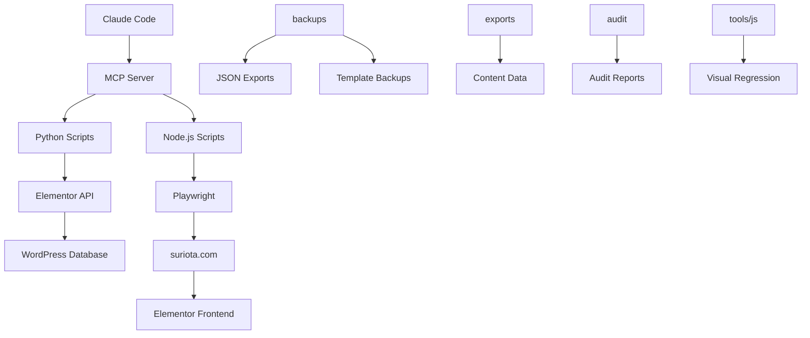
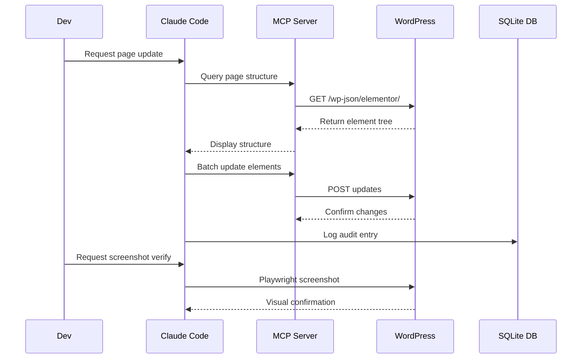
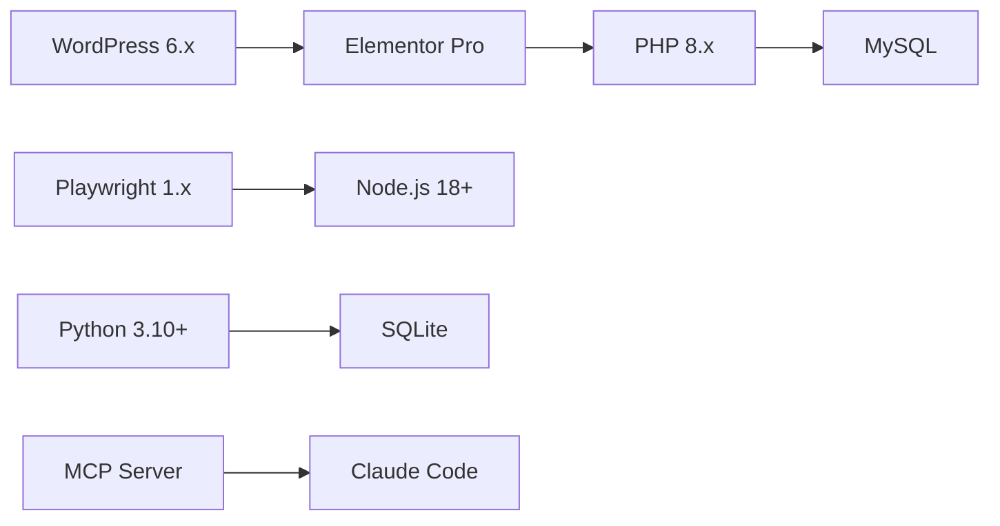

<div align="center">

<h1>SURIOTA Website Toolkit</h1>

<p><strong>AI-assisted automation toolkit for managing suriota.com</strong><br/>
WordPress + Elementor | Playwright | Python | MCP Servers</p>

[](https://github.com/GifariKemal/suriota-website-toolkit/actions)
[](https://github.com/GifariKemal/suriota-website-toolkit)
[](LICENSE)
[](https://wordpress.org)
[](https://elementor.com)
[](https://playwright.dev)

</div>

---

## Table of Contents

- [Overview](#overview)
- [Architecture](#architecture)
- [Recent Updates — 2026-05-28](#recent-updates--2026-05-28)
- [Workflow](#workflow)
- [Features](#features)
- [Quick Start](#quick-start)
- [Folder Structure](#folder-structure)
- [Tools Reference](#tools-reference)
- [Audit Reports](#audit-reports)
- [Design System](#design-system)
- [Tech Stack](#tech-stack)
- [Contributing](#contributing)
- [License](#license)

---

## Overview

This repository contains automation tools, audit reports, design system assets, and backup data for managing [suriota.com](https://suriota.com) — the official website of **PT Surya Inovasi Prioritas (SURIOTA)**. All scripts and assets are organized for AI-assisted website management using Claude Code + MCP Servers.

> **Website:** [suriota.com](https://suriota.com)  
> **Company:** PT Surya Inovasi Prioritas (SURIOTA)  
> **Platform:** WordPress + Elementor Pro  
> **Managed by:** Claude Code + MCP Servers

---

## Architecture



---

## Recent Updates — 2026-05-28

Major session deploying **15 sitewide Elementor snippets (IDs 5638–5659)** and ~100 REST operations:

- **Schema graph**: Organization + LocalBusiness merged via `@id=#organization` (snippet 5192) with full address, openingHours, telephone, email, contactPoint, areaServed, knowsAbout, makesOffer → `#service-catalog`
- **OfferCatalog hub** (snippet 5639): listing 5 pillar Services with `@id` refs
- **Per-pillar Service `@id`** + provider→#organization for IoT, SCADA pillars × EN/ID/ZH (6 pages inline-edited); 3 missing pillars (Modbus, SaaS, Energy) covered via URL-conditional JS (snippet 5649)
- **CollectionPage schema** for `/artikel/` (snippet 5650)
- **Sticky always-visible navbar** sitewide (snippet 5640 v3) with mobile-menu open guard
- **Back-to-top button** sitewide (snippet 5641) — previously only on 4/11 pages
- **Portfolio table v2.1 redesign** — editorial typography, amber accents, hover micro-interactions, mobile card layout. Fixed JS hoisting bug causing intermittent empty-table (`render(cached)` called before `var state` assigned)
- **Related Capabilities cross-links** on 15 pillar pages (snippet 5656)
- **Roboto Google Font dequeue** (snippet 5642), **Geist preload hint** (snippet 5643), **CLS shield** (snippet 5644)
- **Hreflang dedup** between AIOSEO + Polylang (snippet 5659)
- **AIOSEO**: 20 page descriptions backfilled (11 ZH + 8 EN/ID legal), 27 legacy slug pages noindexed + sitemap-excluded (96 → 69 URLs), Schema phone/email/foundingDate/employees populated
- **Redirects**: 4 chains collapsed to single-hop, 3 new 404 redirects added (`/blog/`, `/waste-water-loger/`, old slugs)
- **Image optimization**: `isolated-poster.webp` 614KB → 57KB (-90.7%)
- **Partner logo alt text**: all 20 logos updated via REST Media Library
- **/contact/ duplicate LocalBusiness** dedup, **Portfolio CreativeWork** enriched with `creator: {@id: #organization}` + `url`

Full details per snippet in `~/.claude/projects/.../memory/suriota_active_snippets.md`.

---

## Workflow



---

## Features

| Feature | Description | Status |
|:--------|:------------|:------:|
| **Batch Backup** | Automated WordPress data backup with timestamp | Stable |
| **Visual Audit** | Screenshot regression testing with Playwright | Stable |
| **Elementor API** | Direct manipulation via MCP Tools for Elementor | Stable |
| **Design System** | Centralized tokens, typography, spacing, colors | Stable |
| **Audit Tracking** | SQLite database for tracking findings | Stable |
| **SEO Audit** | AIOSEO meta audit and validation | Stable |
| **Multi-language** | Polylang EN/ID/ZH support scripts | Stable |
| **Font Management** | Sitewide font deployment and cleanup | Stable |

---

## Quick Start

### Prerequisites

- Node.js 18+
- Python 3.10+
- Playwright (for screenshot automation)

### Install

```bash
# Clone repository
git clone https://github.com/GifariKemal/suriota-website-toolkit.git
cd suriota-website-toolkit

# Install Node dependencies
npm install

# Install Playwright browsers
npx playwright install
```

### Usage

```bash
# Backup all WordPress data
node tools/js/backup-all.js

# Screenshot audit 9 key pages
node tools/js/screenshot-audit.js

# Insert audit findings to database
python tools/py/audit_insert.py

# Build final page structure
python tools/py/build_final.py
```

---

## Folder Structure

```
suriota-website-toolkit/
├── README.md                 # This documentation
├── LICENSE                   # License file
├── CONTRIBUTING.md           # Contribution guidelines
├── package.json              # Node.js dependencies
├── .gitignore                # Git ignore rules
│
├── docs/                     # Documentation
│   ├── AGENTS.md             # AI agent instructions
│   └── swarm-config.md       # Agent swarm configuration
│
├── tools/                    # Automation scripts
│   ├── py/                   # Python scripts
│   │   ├── audit_insert.py       # Audit DB insertion
│   │   ├── build_final.py        # Page builder
│   │   ├── build_retina.py       # Retina asset builder
│   │   ├── mkjson.py             # JSON payload generator
│   │   └── update_sections.py    # Batch section updater
│   └── js/                   # JavaScript scripts
│       ├── backup-all.js         # WordPress backup
│       ├── screenshot-audit.js   # Visual regression
│       └── take-screenshots.js   # Playwright screenshots
│
├── audit/                    # Website audit reports (11 files)
│   ├── COMPREHENSIVE-WEBSITE-AUDIT-2026-05-18.md
│   ├── VALIDATION-REPORT-2026-05-19.md
│   └── ...
│
├── backups/                  # WordPress backup data
│   ├── elementor_*.json      # Elementor globals/colors/typography
│   ├── pages.json            # Page structures
│   ├── posts.json            # Post data
│   └── templates/            # Elementor template backups
│
├── design-system/            # Design system assets
│   ├── DESIGN-SYSTEM.md      # Design tokens documentation
│   └── sx-design-system.css  # CSS design system
│
├── exports/                  # Exported data
│   └── json/                 # JSON content exports
│
├── data/                     # Database and data
│   └── db/
│       └── website_audit.db  # SQLite audit database
│
├── content/                  # Content exports
├── media/                    # Media assets
└── templates/                # Template exports
```

---

## Tools Reference

### Python Scripts

| Script | Purpose | Input | Output |
|:-------|:--------|:------|:-------|
| `audit_insert.py` | Insert audit findings | Audit data | SQLite DB |
| `build_final.py` | Build page structures | JSON config | Elementor payload |
| `build_retina.py` | Generate retina assets | Images | 2x/3x variants |
| `mkjson.py` | Generate Elementor JSON | Parameters | API payload |
| `mkjson_compact.py` | Compact JSON generator | Parameters | Minified payload |
| `update_sections.py` | Batch update sections | Section IDs | Updated pages |

### JavaScript Scripts

| Script | Purpose | Input | Output |
|:-------|:--------|:------|:-------|
| `backup-all.js` | Full WordPress backup | WP REST API | Timestamped JSON |
| `screenshot-audit.js` | Visual regression test | URLs | PNG screenshots |
| `take-screenshots.js` | Playwright screenshots | Page list | Organized PNGs |
| `audit-cluster*.js` | Clustered page audits | Page groups | Audit reports |

---

## Audit Reports

| Report | Date | Focus | Severity |
|:-------|:-----|:------|:--------:|
| COMPREHENSIVE-WEBSITE-AUDIT | 2026-05-18 | Full site audit | High |
| VALIDATION-REPORT | 2026-05-19 | Post-fix validation | Medium |
| AIOSEO-AUDIT | 2026-05-18 | SEO meta audit | Medium |
| WP-OPTIMIZE-BASELINE | 2026-05-18 | Performance baseline | Medium |
| FINAL-AUDIT-CLUSTER1 | 2026-05-18 | Homepage cluster | High |
| CLUSTER2-SERVICE-PAGES | 2026-05-18 | Service pages | Medium |
| CLUSTER3-AUDIT | 2026-05-18 | Product pages | Medium |
| CLUSTER4-PORTFOLIO | 2026-05-18 | Portfolio + Internship | Low |
| WEB-HEALTH-CHECK | 2026-05-18 | General health | Medium |
| ABOUT-US-AUDIT | 2026-05-14 | About page | Low |
| DESIGN-CRITIQUE-PORTFOLIO | 2026-05-18 | Portfolio post | Low |

---

## Design System

SX Design System — Industrial Editorial style for suriota.com.

| Token | Value |
|:------|:------|
| **Primary Font** | Geist, Geist Mono |
| **Color Primary** | `#2563EB` |
| **Color Secondary** | `#1E40AF` |
| **Spacing Base** | 8px |
| **Border Radius** | 4px |
| **Container Max** | 1280px |

See full documentation in [`design-system/DESIGN-SYSTEM.md`](design-system/DESIGN-SYSTEM.md).

---

## Tech Stack



| Layer | Technologies |
|:------|:-------------|
| **CMS** | WordPress 6.x + Elementor Pro |
| **Automation** | Python 3.10+, Node.js 18+ |
| **Screenshot** | Playwright, Puppeteer |
| **Database** | SQLite (audit), MySQL (WordPress) |
| **AI Integration** | Claude Code, MCP Servers |
| **Version Control** | Git, GitHub |

---

## Contributing

See [`CONTRIBUTING.md`](CONTRIBUTING.md) for detailed contribution guidelines.

Quick guidelines:
1. Fork the repository
2. Create a branch: `git checkout -b feature/name`
3. Commit using [Conventional Commits](https://conventionalcommits.org)
4. Push and create a Pull Request

---

## License

Proprietary — PT Surya Inovasi Prioritas (SURIOTA)

All rights reserved. Unauthorized copying, distribution, or modification is prohibited.

See [`LICENSE`](LICENSE) for full details.

---

<div align="center">

**[suriota.com](https://suriota.com)** &middot; Made with precision by SURIOTA Engineering

</div>
